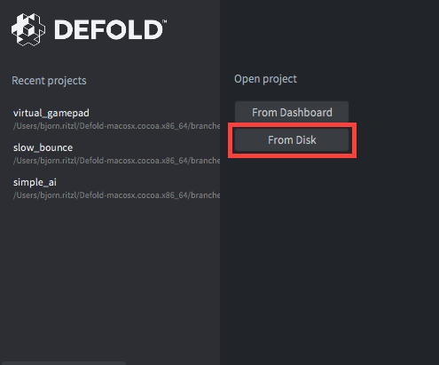
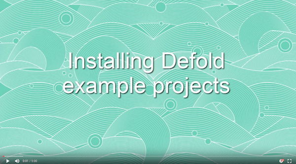

# Public Defold Examples
This is a collection of several small examples for the [Defold](http://www.defold.com) game engine. Most examples are created in response to questions on the [Defold forum](https://forum.defold.com).

## Live examples
See some of the examples live [at the demo site](http://britzl.github.io/publicexamples/):

## How to try the examples yourself
Each example is located in a subfolder of the `examples` folder. Each example is fully self-contained with a game.project file, input bindings and all assets.

### Editor 2
You can try the examples yourself by [downloading](https://github.com/britzl/publicexamples/archive/master.zip), cloning or forking this repository to a location on disk. Open the editor and select to open project From Disk:

Select the game.project file of the example you wish to open.

### Editor 1
You can try the examples yourself by [downloading](https://github.com/britzl/publicexamples/archive/master.zip), cloning or forking this repository to a location on disk. Once this is done you can copy the files of the example you wish to test to an existing Defold project. It is recommended that you create an empty Defold project from the [dashboard](http://dashboard.defold.com/) and copy the files into that project (take care to not remove the .git folder!)

This approach is described in detail by forum user h3annawill in [this excellent video tutorial](https://forum.defold.com/t/how-to-explore-defold-examples-for-the-beginner/3013):

## License
The examples are released under the same [Terms and Conditions as the Defold editor and service itself](http://www.defold.com/about-terms/).

## Credits
Assets by [Kenney](http://www.kenney.nl)
