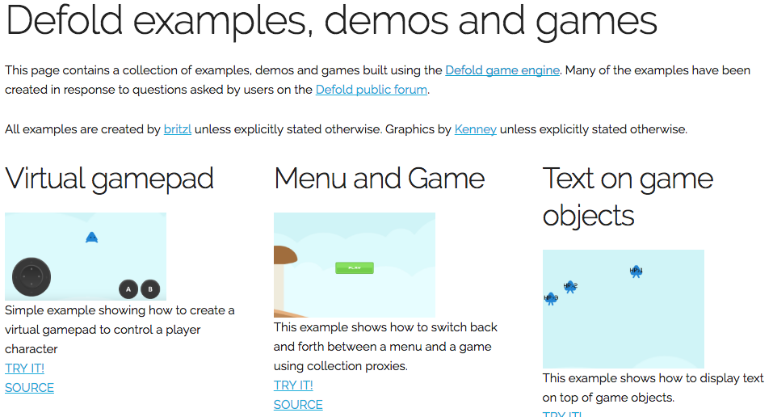

# Public Defold Examples
This is a collection of several small examples for the [Defold](http://www.defold.com) game engine. Most examples are created in response to questions on the [Defold forum](https://forum.defold.com).

## Live examples
See some of the examples live [at the demo site](http://britzl.github.io/publicexamples/):

## How to try the examples yourself
Each example is located in a subfolder of the `examples` folder. Each example is fully self-contained with a game.project file, input bindings and all assets.

### Editor
You can try the examples yourself by [downloading](https://github.com/britzl/publicexamples/archive/master.zip), cloning or forking this repository to a location on disk. Open the editor and select to open project From Disk. Select the game.project file of the example you wish to open.

## Credits
Assets by [Kenney](http://www.kenney.nl)
