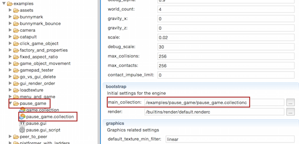

# Public Defold Examples
This project contains several small examples for the [Defold](http://www.defold.com) engine. Most examples are created in response to questions on the [Defold forum](https://forum.defold.com).

## Live examples
See some of the examples live [here](http://britzl.github.io/publicexamples/).

## How to try the examples yourself
Each example is located in a subfolder of the `examples` folder. Each example consists of a main collection with the same name as the folder it is located in:

You can try the examples yourself using one of the following methods:

### Download and copy the files to an existing project
You can try the examples yourself by [downloading](https://github.com/britzl/publicexamples/archive/master.zip) all of the example files and copying them to a Defold project. It is recommended that you create an empty Defold project from the [dashboard](http://dashboard.defold.com/) and copy the files into that project (take care to not remove the .git folder!)

This approach is described in detail by forum user h3annawill in [this excellent video tutorial](https://forum.defold.com/t/how-to-explore-defold-examples-for-the-beginner/3013).

### Fork the project and change remote repo of an existing project
Another way to try the examples is to [fork the project](https://github.com/britzl/publicexamples#fork-destination-box) and then [change the remote repository](https://help.github.com/articles/changing-a-remote-s-url/) of an existing Defold project so that it points to your fork on GitHub. It is recommended that you create an empty Defold project from the [dashboard](http://dashboard.defold.com/). The advantage of this solution is that it is easy to pull new examples and fixes from this project into your own fork.

## License
This examples are released under the same [Terms and Conditions as the Defold editor and service itself](http://www.defold.com/about-terms/).

## Credits
Assets by [Kenney](http://www.kenney.nl)
