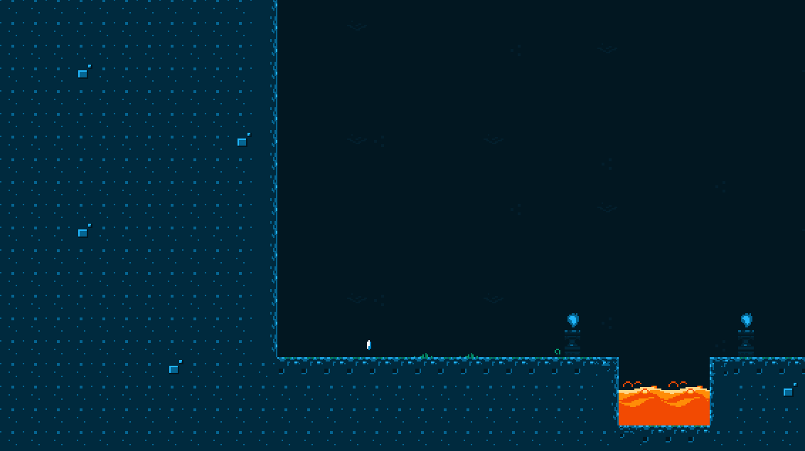
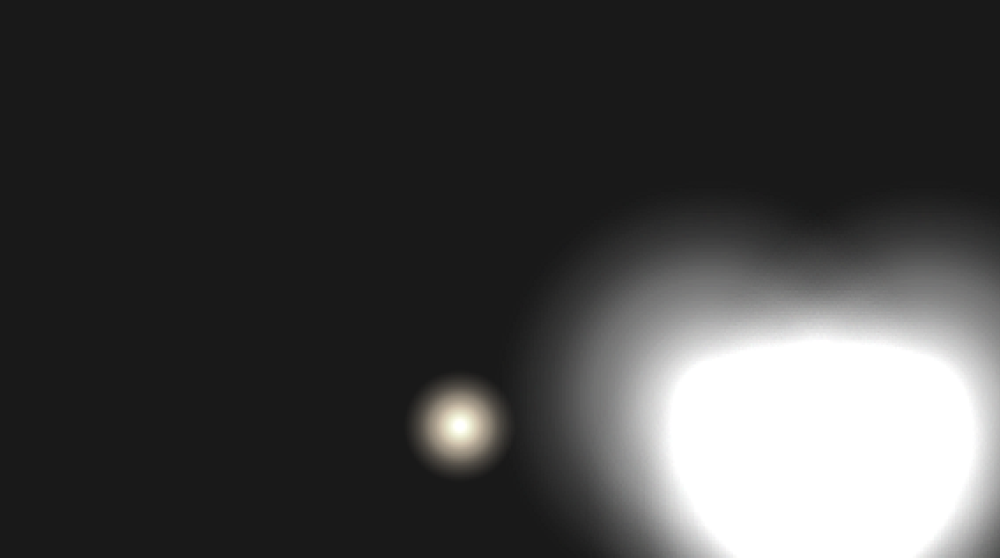
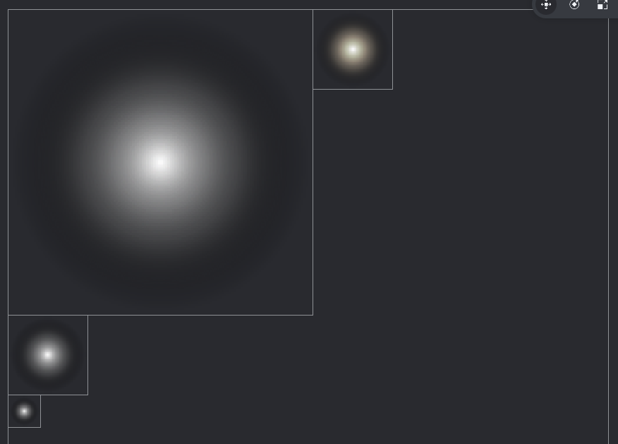
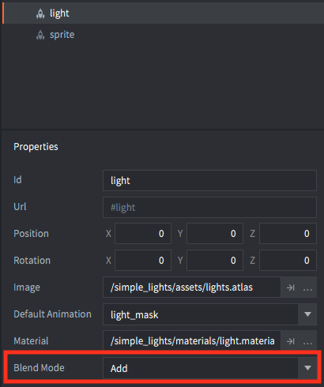
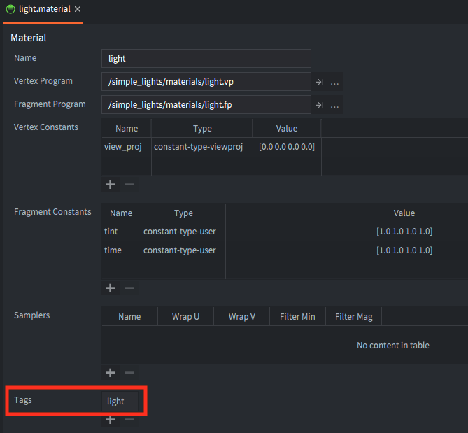
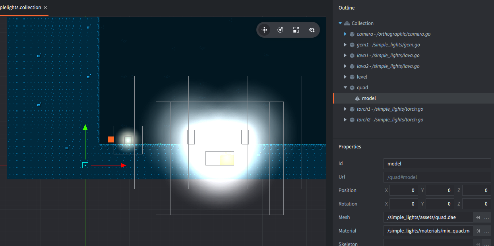
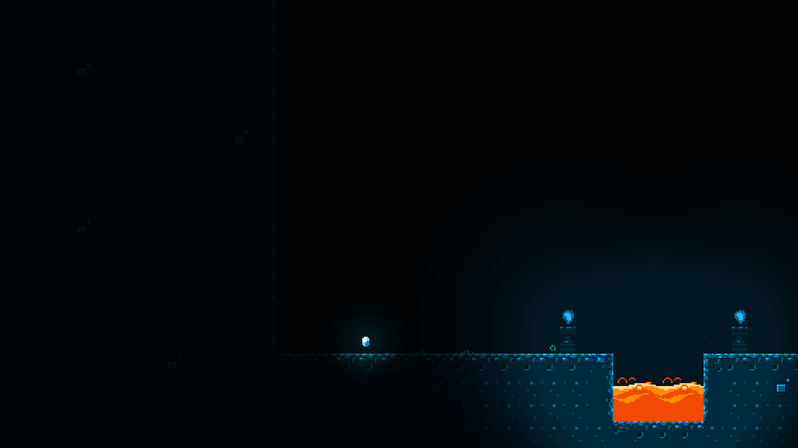

# Simple 2D Lights
This example shows how to create simple 2D light sources.

Asked on the forum https://forum.defold.com/t/simple-2d-lighting/14545/10

**STEP 1 - DRAW NORMAL COMPONENTS TO RENDER TARGET**
Draw your sprites, tilemaps and any other components you have in your game to a render target (a texture in memory) instead of directly to screen.

You create a render target using [`render.render_target()`](https://www.defold.com/ref/render/#render.render_target:name-parameters). You enable it in your render script, draw using the normal render calls, then disable it again. Done!

**STEP 2 - DRAW LIGHTS TO RENDER TARGET**
Draw your lights to another render target. Clear the render target with a semitransparent black color for some ambient light.

In this example the lights are circular sprites of various sizes and with increasing transparency.

They are drawn with a Blend Mode set to Add instead of Alpha.

The sprites have a different material assigned than the normal sprite material. The material uses another tag/predicate so that it doesn't get drawn with everything else in step 1.

**STEP 3 - DRAW A MIX OF BOTH RENDER TARGETS TO A QUAD ON SCREEN**
Draw a mix of the two render targets to a model component with a quad (a rectangle) and draw it so that it fills the entire screen.

The quad has a separate material which takes two textures as input parameters and it uses a new tag/predicate so that we can draw it in a separate pass.

Each pixels is a multiplication of the pixel value from the normal graphics and the light. Final result:

## Try it!
http://britzl.github.io/publicexamples/simple_lights/index.html
